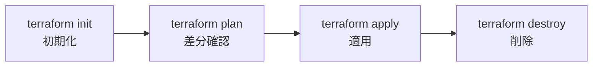

# Phase 1: Terraform 基礎

## Terraform とは

HashiCorp が開発した Infrastructure as Code (IaC) ツール。HCL (HashiCorp Configuration Language) でインフラを宣言的に記述し、クラウドリソースの作成・変更・削除を自動化する。

## 核となるコンセプト

### 宣言的 vs 手続き的

| 手法 | 例 | 特徴 |
|------|----|------|
| 手続き的 | シェルスクリプト, Ansible | 「手順」を書く |
| **宣言的** | **Terraform**, CloudFormation | 「あるべき状態」を書く |

Terraform は「EC2 を 3 台起動しろ」ではなく「EC2 が 3 台ある状態にしろ」と書く。現在の状態との差分を計算し、必要な操作だけを実行する。

### コアワークフロー



## HCL コードの読み方

Terraform のコードを読むために必要な最低限のルールを先に押さえる。

### 基本ルール

```hcl
ブロック種別 "タイプ" "名前" {
  属性名 = 値
}
```

| 要素 | 意味 | 例 |
|------|------|-----|
| `ブロック種別` | 何を定義するか | `resource`, `variable`, `output`, `provider` |
| `"タイプ"` | どのサービスのリソースか | `"aws_s3_bucket"`, `"aws_vpc"` |
| `"名前"` | このコード内での呼び名 (自分で決める) | `"example"`, `"main"` |
| `{ }` | ブロックの中身。設定を書く | |
| `=` | 属性に値を代入する | `region = "ap-northeast-1"` |

### よく出てくるパターン

```hcl
# パターン1: リソースを作る
resource "aws_s3_bucket" "example" {   # AWS の S3 バケットを "example" という名前で定義
  bucket = "my-bucket"                  # バケット名を指定
}

# パターン2: 他のリソースを参照する
resource "aws_s3_bucket_versioning" "example" {
  bucket = aws_s3_bucket.example.id     # ↑で作ったバケットの ID を参照
}
#          ^^^^^^^^^^^^^^^^ ^^^^^^^ ^^
#          タイプ            名前    属性
#          「aws_s3_bucket の example という名前のリソースの id」

# パターン3: 変数を使う
bucket = "platform-infra-${var.env}"
#                         ^^^^^^^^
#                         var.変数名 で変数の値を埋め込む
#                         ${} は文字列の中に値を埋め込む書き方
```

### 読み方のコツ

- `aws_` で始まるタイプ名は AWS のサービスに対応する (`aws_vpc` → VPC, `aws_subnet` → サブネット)
- `リソースタイプ.名前.属性` で他リソースの値を参照できる
- `#` 以降はコメント (実行されない)
- `true` / `false` は真偽値
- `"..."` は文字列

## ハンズオン: 最初のリソース

### 1. プロジェクトの初期化

```bash
mkdir -p envs/dev
cd envs/dev
```

### 2. Provider の設定

```hcl
# envs/dev/main.tf

terraform {
  required_version = ">= 1.5.0"

  required_providers {
    aws = {
      source  = "hashicorp/aws"
      version = "~> 5.0"
    }
  }
}

provider "aws" {
  region = "ap-northeast-1"

  default_tags {
    tags = {
      Project     = "platform-infra"
      Environment = "dev"
      ManagedBy   = "terraform"
    }
  }
}
```

**コードの読み方:**

| 行 | 意味 |
|---|---|
| `terraform { }` | Terraform 自体の設定ブロック |
| `required_version = ">= 1.5.0"` | Terraform のバージョン 1.5.0 以上が必要 |
| `required_providers { aws = { ... } }` | AWS プロバイダーを使うことを宣言。`source` はどこからダウンロードするか、`version` はバージョン指定 |
| `"~> 5.0"` | 5.0 以上 6.0 未満を意味する (メジャーバージョンは固定、マイナーは最新を使う) |
| `provider "aws" { }` | AWS プロバイダーの接続設定。ここで「どのリージョンに作るか」などを指定する |
| `region = "ap-northeast-1"` | 東京リージョンを使う |
| `default_tags { tags = { ... } }` | この設定以降で作るすべてのリソースに自動でタグを付ける。誰が何で管理しているかの目印 |

### 3. 最初のリソース (S3 バケット)

```hcl
# envs/dev/s3.tf

resource "aws_s3_bucket" "example" {
  bucket = "platform-infra-example-dev"  # グローバルで一意にすること
}

resource "aws_s3_bucket_versioning" "example" {
  bucket = aws_s3_bucket.example.id

  versioning_configuration {
    status = "Enabled"
  }
}
```

**コードの読み方:**

| 行 | 意味 |
|---|---|
| `resource "aws_s3_bucket" "example"` | `resource` = リソースを作る宣言。`"aws_s3_bucket"` = S3 バケット。`"example"` = このコード内での呼び名 |
| `bucket = "platform-infra-example-dev"` | 実際の S3 バケット名。AWS 上でこの名前で作られる |
| `resource "aws_s3_bucket_versioning" "example"` | S3 のバージョニング設定を作る (別リソースとして定義する) |
| `bucket = aws_s3_bucket.example.id` | 上で作った S3 バケットの ID を参照して「このバケットに対する設定だ」と紐づける |
| `status = "Enabled"` | バージョニングを有効にする |

ポイント: Terraform では **1つの AWS リソースが複数のブロックに分かれる** ことがよくある。S3 バケット本体 (`aws_s3_bucket`) とバージョニング設定 (`aws_s3_bucket_versioning`) は別ブロックだが、`bucket = aws_s3_bucket.example.id` で紐づいている。

### 4. 実行

```bash
terraform init     # プロバイダーのダウンロード
terraform plan     # 何が作られるか確認 (実際には何も変更しない)
terraform apply    # 実行 (yes を入力)
terraform destroy  # 後片付け
```

## HCL の基本構文

### 変数 (variables)

```hcl
# variables.tf
variable "env" {
  type        = string
  description = "環境名"
  default     = "dev"
}

variable "allowed_cidrs" {
  type        = list(string)
  description = "許可する CIDR ブロック"
  default     = ["10.0.0.0/16"]
}

# 使い方
resource "aws_s3_bucket" "example" {
  bucket = "platform-infra-${var.env}"
}
```

**コードの読み方:**

| 行 | 意味 |
|---|---|
| `variable "env" { }` | `"env"` という名前の変数を定義する |
| `type = string` | この変数は文字列型 |
| `description = "環境名"` | 変数の説明 (ドキュメント用。動作には影響しない) |
| `default = "dev"` | 値を指定しなかった場合のデフォルト値 |
| `type = list(string)` | 文字列のリスト型。`["a", "b"]` のように複数の値を持てる |
| `"platform-infra-${var.env}"` | `${var.env}` の部分が変数の値に置き換わる。`env` が `"dev"` なら `"platform-infra-dev"` になる |

### 出力 (outputs)

```hcl
# outputs.tf
output "bucket_arn" {
  value       = aws_s3_bucket.example.arn
  description = "作成した S3 バケットの ARN"
}
```

**コードの読み方:**

| 行 | 意味 |
|---|---|
| `output "bucket_arn" { }` | `terraform apply` 後にターミナルに表示される出力値を定義する |
| `value = aws_s3_bucket.example.arn` | `aws_s3_bucket` の `example` リソースの `arn` (AWS 内での一意な識別子) を出力する |

### ローカル値 (locals)

```hcl
locals {
  name_prefix = "platform-infra-${var.env}"
}

resource "aws_s3_bucket" "example" {
  bucket = "${local.name_prefix}-tfstate"
}
```

**コードの読み方:**

| 行 | 意味 |
|---|---|
| `locals { }` | このファイル内で使える定数を定義する。変数 (`variable`) と違い、外から値を変えられない |
| `name_prefix = "platform-infra-${var.env}"` | よく使う文字列をまとめておく。`var.env` が `"dev"` なら `"platform-infra-dev"` |
| `${local.name_prefix}` | `local.名前` で参照する。`variable` は `var.名前`、`locals` は `local.名前` |

### データソース (data)

```hcl
# 既存リソースの参照 (作成ではなく読み取り)
data "aws_caller_identity" "current" {}

output "account_id" {
  value = data.aws_caller_identity.current.account_id
}
```

**コードの読み方:**

| 行 | 意味 |
|---|---|
| `data "aws_caller_identity" "current" {}` | `data` = 既存の情報を読み取る (新しいリソースは作らない)。ここでは「今 AWS にログインしているアカウント情報」を取得 |
| `data.aws_caller_identity.current.account_id` | `data.タイプ.名前.属性` で参照する。`resource` の参照と似ているが先頭に `data.` が付く |

`resource` と `data` の違い:
- `resource` → リソースを **作る** (`aws_s3_bucket` など)
- `data` → 既存の情報を **読み取る** だけ (何も作らない)

## State とは

Terraform は管理しているリソースの現在の状態を `terraform.tfstate` に保存する。

- state は **信頼できる唯一の情報源 (Single Source of Truth)**
- state がないと Terraform は既存リソースを認識できない
- **state ファイルは Git にコミットしない** (シークレットが含まれる可能性がある)

```gitignore
# .gitignore に追加
*.tfstate
*.tfstate.backup
.terraform/
```

## よく使うコマンド

| コマンド | 説明 |
|---------|------|
| `terraform init` | 初期化 (プロバイダーのダウンロード) |
| `terraform plan` | 差分の確認 |
| `terraform apply` | 変更の適用 |
| `terraform destroy` | リソースの全削除 |
| `terraform fmt` | コードのフォーマット |
| `terraform validate` | 構文チェック |
| `terraform state list` | state 内のリソース一覧 |
| `terraform output` | 出力値の表示 |

## 次のステップ

- [Phase 2: AWS インフラ設計](02-aws-infrastructure.md) で VPC, サブネット, セキュリティグループなどを構築する
