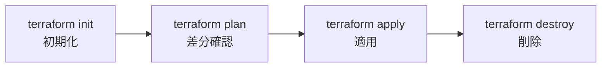

# Phase 1: Terraform 基礎

## Terraform とは

HashiCorp が開発した Infrastructure as Code (IaC) ツール。HCL (HashiCorp Configuration Language) でインフラを宣言的に記述し、クラウドリソースの作成・変更・削除を自動化する。

## 核となるコンセプト

### 宣言的 vs 手続き的

| 手法 | 例 | 特徴 |
|------|----|------|
| 手続き的 | シェルスクリプト, Ansible | 「手順」を書く |
| **宣言的** | **Terraform**, CloudFormation | 「あるべき状態」を書く |

Terraform は「EC2 を 3 台起動しろ」ではなく「EC2 が 3 台ある状態にしろ」と書く。現在の状態との差分を計算し、必要な操作だけを実行する。

### コアワークフロー



## ハンズオン: 最初のリソース

### 1. プロジェクトの初期化

```bash
mkdir -p envs/dev
cd envs/dev
```

### 2. Provider の設定

```hcl
# envs/dev/main.tf

terraform {
  required_version = ">= 1.5.0"

  required_providers {
    aws = {
      source  = "hashicorp/aws"
      version = "~> 5.0"
    }
  }
}

provider "aws" {
  region = "ap-northeast-1"

  default_tags {
    tags = {
      Project     = "platform-infra"
      Environment = "dev"
      ManagedBy   = "terraform"
    }
  }
}
```

### 3. 最初のリソース (S3 バケット)

```hcl
# envs/dev/s3.tf

resource "aws_s3_bucket" "example" {
  bucket = "platform-infra-example-dev"  # グローバルで一意にすること
}

resource "aws_s3_bucket_versioning" "example" {
  bucket = aws_s3_bucket.example.id

  versioning_configuration {
    status = "Enabled"
  }
}
```

### 4. 実行

```bash
terraform init     # プロバイダーのダウンロード
terraform plan     # 何が作られるか確認 (実際には何も変更しない)
terraform apply    # 実行 (yes を入力)
terraform destroy  # 後片付け
```

## HCL の基本構文

### 変数 (variables)

```hcl
# variables.tf
variable "env" {
  type        = string
  description = "環境名"
  default     = "dev"
}

variable "allowed_cidrs" {
  type        = list(string)
  description = "許可する CIDR ブロック"
  default     = ["10.0.0.0/16"]
}

# 使い方
resource "aws_s3_bucket" "example" {
  bucket = "platform-infra-${var.env}"
}
```

### 出力 (outputs)

```hcl
# outputs.tf
output "bucket_arn" {
  value       = aws_s3_bucket.example.arn
  description = "作成した S3 バケットの ARN"
}
```

### ローカル値 (locals)

```hcl
locals {
  name_prefix = "platform-infra-${var.env}"
}

resource "aws_s3_bucket" "example" {
  bucket = "${local.name_prefix}-tfstate"
}
```

### データソース (data)

```hcl
# 既存リソースの参照 (作成ではなく読み取り)
data "aws_caller_identity" "current" {}

output "account_id" {
  value = data.aws_caller_identity.current.account_id
}
```

## State とは

Terraform は管理しているリソースの現在の状態を `terraform.tfstate` に保存する。

- state は **信頼できる唯一の情報源 (Single Source of Truth)**
- state がないと Terraform は既存リソースを認識できない
- **state ファイルは Git にコミットしない** (シークレットが含まれる可能性がある)

```gitignore
# .gitignore に追加
*.tfstate
*.tfstate.backup
.terraform/
```

## よく使うコマンド

| コマンド | 説明 |
|---------|------|
| `terraform init` | 初期化 (プロバイダーのダウンロード) |
| `terraform plan` | 差分の確認 |
| `terraform apply` | 変更の適用 |
| `terraform destroy` | リソースの全削除 |
| `terraform fmt` | コードのフォーマット |
| `terraform validate` | 構文チェック |
| `terraform state list` | state 内のリソース一覧 |
| `terraform output` | 出力値の表示 |

## 次のステップ

- [Phase 2: AWS インフラ設計](02-aws-infrastructure.md) で VPC, サブネット, セキュリティグループなどを構築する
