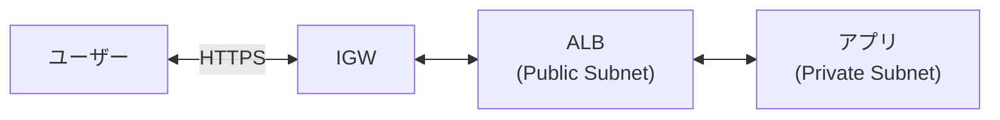
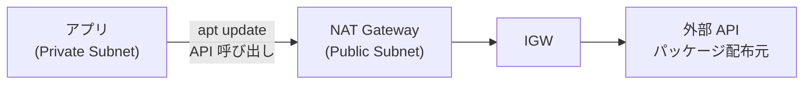
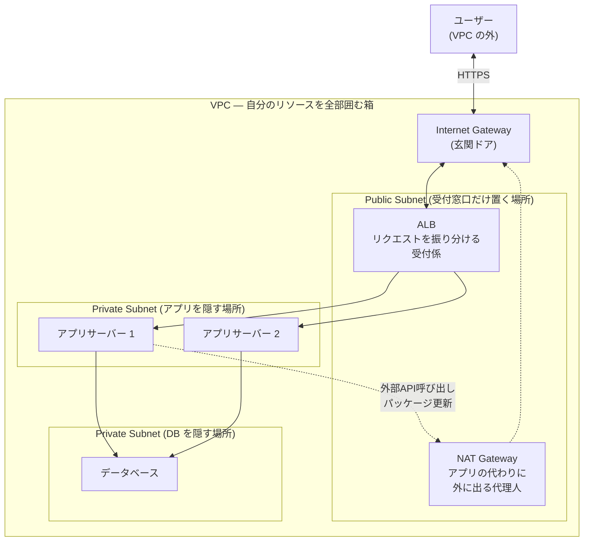
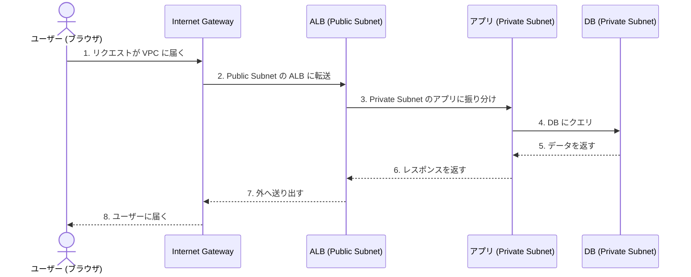
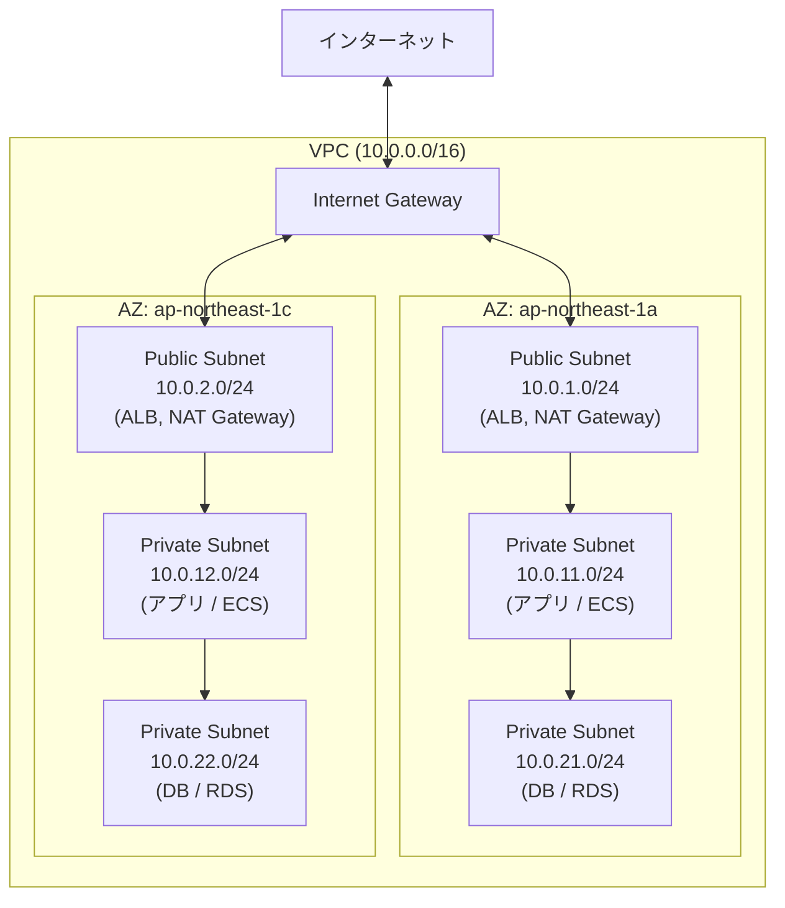
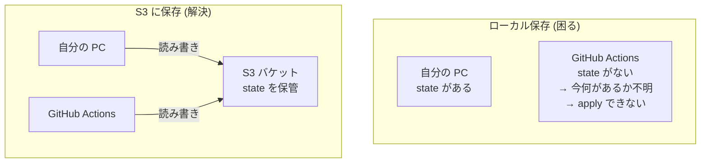
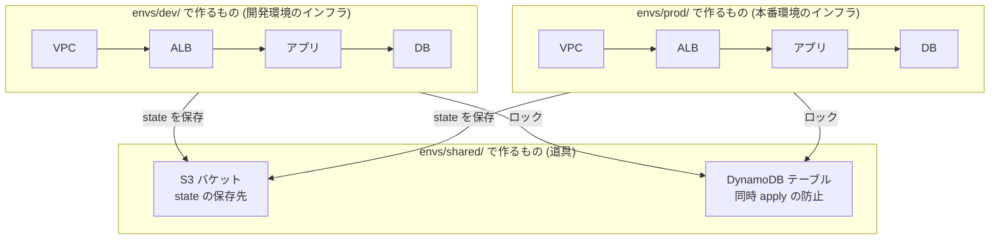
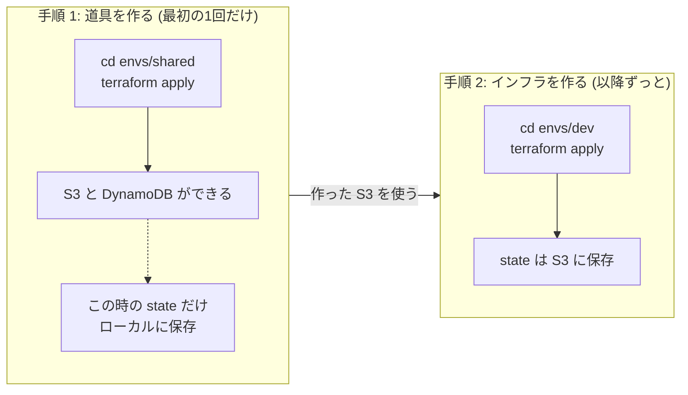

# Phase 2: AWS インフラ設計

## このフェーズのゴール

Terraform で AWS 上に本番を意識したネットワーク基盤を構築する。

## 用語解説

このドキュメントで使う専門用語を先に整理する。

### ネットワーク系

| 用語 | 意味 |
|------|------|
| **VPC** | Virtual Private Cloud。AWS 上に作る自分専用のネットワーク空間 |
| **サブネット** | VPC の中をさらに区切ったネットワーク |
| **Public Subnet** | インターネットと直接通信できるサブネット |
| **Private Subnet** | インターネットから直接アクセスできないサブネット |
| **AZ (Availability Zone)** | AWS データセンターの物理的な場所。障害に備えて複数の AZ に分散配置する |
| **CIDR** | IP アドレスの範囲を表す記法。`10.0.0.0/16` は「10.0.x.x の 65,536 個の IP」を意味する |

### ゲートウェイ・ルーティング系

| 用語 | 意味 |
|------|------|
| **Internet Gateway (IGW)** | VPC とインターネットをつなぐ出入口。**双方向通信** (外→内、内→外) ができる |
| **NAT Gateway** | Private Subnet からインターネットへ出るための中継地点。**内→外の片方向だけ**。外からはアクセスできない |
| **EIP (Elastic IP)** | 固定のパブリック IP アドレス。NAT Gateway に割り当てて使う |
| **Route Table** | 「この宛先のトラフィックはここに送れ」というルーティングルール |

#### Internet Gateway と NAT Gateway の違い

**Internet Gateway 経由 (双方向)** — ユーザーがアプリにアクセスする場合:



**NAT Gateway 経由 (内→外のみ)** — アプリが外部 API を呼ぶ場合:



| | Internet Gateway | NAT Gateway |
|---|---|---|
| **通信の方向** | 双方向 (外↔内) | 内→外の片方向のみ |
| **外からアクセス** | できる | できない |
| **使う場面** | ユーザーからのリクエストを受ける (ALB など) | アプリが外部と通信する (パッケージ更新、外部 API 呼び出し) |
| **なぜ必要か** | これがないと VPC はインターネットに繋がらない | アプリを外部から隠しつつ、アプリ側からは外に出られるようにする |

### セキュリティ系

| 用語 | 意味 |
|------|------|
| **Security Group (SG)** | リソースへの通信を許可/拒否するファイアウォール |
| **Ingress** | 外から中への通信 (受信ルール) |
| **Egress** | 中から外への通信 (送信ルール) |
| **ポート 443** | HTTPS 通信で使うポート番号 |

### AWS サービス系

| 用語 | 意味 |
|------|------|
| **ALB (Application Load Balancer)** | ユーザーからのリクエストを複数のサーバーに振り分ける |
| **ECS (Elastic Container Service)** | Docker コンテナを AWS 上で動かすサービス |
| **RDS (Relational Database Service)** | マネージドなデータベース (MySQL, PostgreSQL など) |
| **S3** | オブジェクトストレージ。ファイル保存やTerraform の state 保管に使う |
| **DynamoDB** | NoSQL データベース。Terraform の state ロックに使う |

## 全体像: リソースはすべて VPC の中にいる

AWS のリソース (ALB, アプリ, DB など) は**すべて VPC の中に配置される**。VPC の外にいるのはユーザー (インターネット) だけ。



| VPC の外 | VPC の中 |
|---------|---------|
| ユーザー (インターネット) | IGW, ALB, NAT Gateway, アプリ, DB — **全部** |

## リクエストの流れ

ユーザーがアプリにアクセスすると、以下の順で通信が流れる。



## ネットワーク構成図 (詳細)

実際に構築する構成。障害に備えて 2 つの AZ (データセンター) に同じ構成を複製する。



### なぜ 3 層に分けるのか

| 層 | 何を置くか | 外からアクセス | 役割 |
|----|-----------|--------------|------|
| **Public Subnet** | ALB, NAT Gateway | できる | インターネットとの仲介役 (受付窓口) だけ置く |
| **Private Subnet (App)** | アプリサーバー (ECS) | できない (ALB 経由のみ) | 実際の処理を行う。外から直接見えない |
| **Private Subnet (DB)** | データベース (RDS) | できない (アプリからのみ) | 最も保護された場所。データを守る |

こうすることで、外部からの攻撃が DB に直接届かない安全な構成になる。

## 構築するリソース

### 1. VPC + サブネット

VPC (ネットワーク空間) を作り、その中にサブネット (区画) を配置する。

```hcl
# modules/network/main.tf

resource "aws_vpc" "main" {
  cidr_block           = var.vpc_cidr           # VPC の IP アドレス範囲
  enable_dns_support   = true                   # VPC 内で DNS 解決を有効化
  enable_dns_hostnames = true                   # EC2 などに DNS ホスト名を付与

  tags = {
    Name = "${var.name_prefix}-vpc"
  }
}

# Public Subnet — インターネットからアクセスできる区画
resource "aws_subnet" "public" {
  count             = length(var.public_subnets)  # サブネットの数だけ繰り返し作成
  vpc_id            = aws_vpc.main.id             # どの VPC に作るか
  cidr_block        = var.public_subnets[count.index]  # IP アドレス範囲
  availability_zone = var.azs[count.index]        # どの AZ に配置するか

  map_public_ip_on_launch = true  # この中に作ったリソースに自動でパブリック IP を付与

  tags = {
    Name = "${var.name_prefix}-public-${var.azs[count.index]}"
    Tier = "public"
  }
}

# Private Subnet (App) — アプリサーバー用。インターネットから直接アクセスできない
resource "aws_subnet" "private_app" {
  count             = length(var.private_app_subnets)
  vpc_id            = aws_vpc.main.id
  cidr_block        = var.private_app_subnets[count.index]
  availability_zone = var.azs[count.index]

  tags = {
    Name = "${var.name_prefix}-private-app-${var.azs[count.index]}"
    Tier = "private-app"
  }
}

# Private Subnet (DB) — データベース用。アプリからのみアクセス可能
resource "aws_subnet" "private_db" {
  count             = length(var.private_db_subnets)
  vpc_id            = aws_vpc.main.id
  cidr_block        = var.private_db_subnets[count.index]
  availability_zone = var.azs[count.index]

  tags = {
    Name = "${var.name_prefix}-private-db-${var.azs[count.index]}"
    Tier = "private-db"
  }
}
```

**コードの読み方:**

まず VPC 本体:

| 行 | 意味 |
|---|---|
| `resource "aws_vpc" "main"` | VPC を作る。このコード内では `"main"` という名前で参照する |
| `cidr_block = var.vpc_cidr` | VPC の IP アドレス範囲。変数から受け取る (例: `"10.0.0.0/16"`) |
| `enable_dns_support = true` | VPC 内でドメイン名 → IP アドレスの変換ができるようにする |
| `tags = { Name = "..." }` | AWS コンソールで表示される名前タグ |

次にサブネット (ここが一番複雑):

| 行 | 意味 |
|---|---|
| `count = length(var.public_subnets)` | `count` はリソースを複数個作る仕組み。`var.public_subnets` が 2 個のリストなら、サブネットも 2 個作る |
| `vpc_id = aws_vpc.main.id` | 「上で作った VPC の中に作る」という紐づけ |
| `var.public_subnets[count.index]` | `count.index` は繰り返しの番号 (0, 1, 2...)。リストの 0 番目、1 番目... を順に取り出す |
| `availability_zone = var.azs[count.index]` | サブネットごとに別の AZ に配置する |
| `map_public_ip_on_launch = true` | このサブネットに作ったリソースに自動でパブリック IP を付ける (Public Subnet だけの設定) |

`count` の動きを具体的に見ると:

```
var.public_subnets = ["10.0.1.0/24", "10.0.2.0/24"]
var.azs            = ["ap-northeast-1a", "ap-northeast-1c"]

→ count = 2 なので 2 回繰り返す:
  count.index=0: cidr_block="10.0.1.0/24", az="ap-northeast-1a"
  count.index=1: cidr_block="10.0.2.0/24", az="ap-northeast-1c"
```

Private Subnet (App, DB) も同じパターン。`map_public_ip_on_launch` がないのが Public との違い。

### 2. Internet Gateway + NAT Gateway

- **Internet Gateway**: VPC とインターネットをつなぐ (Public Subnet 用)
- **NAT Gateway**: Private Subnet からインターネットへ出る中継地点 (外からはアクセスされない)

```hcl
# modules/network/gateway.tf

# Internet Gateway — VPC の「正面玄関」
resource "aws_internet_gateway" "main" {
  vpc_id = aws_vpc.main.id

  tags = {
    Name = "${var.name_prefix}-igw"
  }
}

# Elastic IP — NAT Gateway に割り当てる固定 IP
resource "aws_eip" "nat" {
  count  = length(var.azs)
  domain = "vpc"

  tags = {
    Name = "${var.name_prefix}-nat-eip-${var.azs[count.index]}"
  }
}

# NAT Gateway — Private Subnet から外へ出るための「代理人」
resource "aws_nat_gateway" "main" {
  count         = length(var.azs)
  allocation_id = aws_eip.nat[count.index].id       # 割り当てる固定 IP
  subnet_id     = aws_subnet.public[count.index].id  # Public Subnet に配置する

  tags = {
    Name = "${var.name_prefix}-nat-${var.azs[count.index]}"
  }

  depends_on = [aws_internet_gateway.main]  # IGW が先にできていないと動かない
}
```

**コードの読み方:**

| 行 | 意味 |
|---|---|
| `resource "aws_internet_gateway" "main"` | Internet Gateway を作る。VPC をインターネットに接続するために必要 |
| `vpc_id = aws_vpc.main.id` | どの VPC に取り付けるか |
| `resource "aws_eip" "nat"` | Elastic IP (固定 IP アドレス) を作る |
| `count = length(var.azs)` | AZ の数だけ作る (AZ ごとに NAT Gateway を置くため) |
| `domain = "vpc"` | この IP は VPC 内で使うことを宣言 |
| `resource "aws_nat_gateway" "main"` | NAT Gateway を作る |
| `allocation_id = aws_eip.nat[count.index].id` | 上で作った EIP を NAT Gateway に割り当てる。`[count.index]` で「同じ番号のもの」を紐づける |
| `subnet_id = aws_subnet.public[count.index].id` | NAT Gateway は Public Subnet に配置する (Private Subnet の代わりに外と通信するため) |
| `depends_on = [aws_internet_gateway.main]` | 「IGW が先に作られてからこのリソースを作れ」という順序指定。通常 Terraform は参照関係から自動で順序を決めるが、明示的に指定が必要な場合に使う |

### 3. Route Table

通信の経路を定義する。「宛先がインターネットなら、どのゲートウェイに送るか」を決める。

```hcl
# modules/network/routes.tf

# Public 用: インターネット宛の通信 → Internet Gateway へ直接送る
resource "aws_route_table" "public" {
  vpc_id = aws_vpc.main.id

  route {
    cidr_block = "0.0.0.0/0"                    # 「すべての宛先」を意味する
    gateway_id = aws_internet_gateway.main.id    # Internet Gateway に送る
  }

  tags = {
    Name = "${var.name_prefix}-public-rt"
  }
}

# Route Table をサブネットに紐づける
resource "aws_route_table_association" "public" {
  count          = length(var.public_subnets)
  subnet_id      = aws_subnet.public[count.index].id
  route_table_id = aws_route_table.public.id
}

# Private 用: インターネット宛の通信 → NAT Gateway 経由で出る
resource "aws_route_table" "private" {
  count  = length(var.azs)
  vpc_id = aws_vpc.main.id

  route {
    cidr_block     = "0.0.0.0/0"                          # すべての宛先
    nat_gateway_id = aws_nat_gateway.main[count.index].id  # NAT Gateway 経由
  }

  tags = {
    Name = "${var.name_prefix}-private-rt-${var.azs[count.index]}"
  }
}
```

**コードの読み方:**

| 行 | 意味 |
|---|---|
| `resource "aws_route_table" "public"` | ルートテーブル (通信の経路案内表) を作る |
| `route { }` | ルートテーブル内にルール (経路) を定義するブロック |
| `cidr_block = "0.0.0.0/0"` | 宛先の指定。`0.0.0.0/0` は「すべての宛先」を意味する特別な CIDR |
| `gateway_id = aws_internet_gateway.main.id` | その通信を Internet Gateway に送る |
| `resource "aws_route_table_association" "public"` | ルートテーブルとサブネットの紐づけ。ルートテーブルを作っただけでは機能せず、「どのサブネットで使うか」を指定する必要がある |
| `route_table_id = aws_route_table.public.id` | 上で作った Public 用のルートテーブルを指定 |
| `nat_gateway_id = aws_nat_gateway.main[count.index].id` | Private 用は NAT Gateway 経由にする (Internet Gateway ではなく) |

Public と Private の違い:
- **Public**: 外への通信 → Internet Gateway に直接送る (`gateway_id`)
- **Private**: 外への通信 → NAT Gateway 経由で送る (`nat_gateway_id`)

### 4. Security Group

リソースへの通信許可/拒否を設定するファイアウォール。

```hcl
# modules/network/security_groups.tf

# ALB 用: インターネットからの HTTPS (ポート 443) を許可
resource "aws_security_group" "alb" {
  name_prefix = "${var.name_prefix}-alb-"
  vpc_id      = aws_vpc.main.id

  # 受信: インターネットからの HTTPS を許可
  ingress {
    from_port   = 443
    to_port     = 443
    protocol    = "tcp"
    cidr_blocks = ["0.0.0.0/0"]  # すべての IP から
  }

  # 送信: すべての通信を許可
  egress {
    from_port   = 0
    to_port     = 0
    protocol    = "-1"            # -1 = すべてのプロトコル
    cidr_blocks = ["0.0.0.0/0"]
  }

  tags = {
    Name = "${var.name_prefix}-alb-sg"
  }

  lifecycle {
    create_before_destroy = true  # 更新時に新しい SG を先に作ってから古いのを消す
  }
}

# App 用: ALB からのポート 8080 のみ許可 (インターネットからは直接来ない)
resource "aws_security_group" "app" {
  name_prefix = "${var.name_prefix}-app-"
  vpc_id      = aws_vpc.main.id

  # 受信: ALB の Security Group からのみ許可
  ingress {
    from_port       = 8080
    to_port         = 8080
    protocol        = "tcp"
    security_groups = [aws_security_group.alb.id]  # ALB からのみ
  }

  egress {
    from_port   = 0
    to_port     = 0
    protocol    = "-1"
    cidr_blocks = ["0.0.0.0/0"]
  }

  tags = {
    Name = "${var.name_prefix}-app-sg"
  }

  lifecycle {
    create_before_destroy = true
  }
}
```

**コードの読み方:**

ALB 用の Security Group:

| 行 | 意味 |
|---|---|
| `resource "aws_security_group" "alb"` | Security Group (ファイアウォール) を作る |
| `name_prefix = "${var.name_prefix}-alb-"` | AWS 上でのリソース名の先頭部分。Terraform がこの後にランダム文字列を付ける |
| `ingress { }` | 受信ルール (外 → 中への通信の許可設定) |
| `from_port = 443` / `to_port = 443` | ポート 443 (HTTPS) だけを許可。両方同じ値 = 1つのポートのみ |
| `protocol = "tcp"` | TCP プロトコルを許可 |
| `cidr_blocks = ["0.0.0.0/0"]` | すべての IP アドレスからのアクセスを許可 |
| `egress { }` | 送信ルール (中 → 外への通信の許可設定) |
| `protocol = "-1"` | `-1` は「すべてのプロトコル」を意味する特別な値 |
| `lifecycle { create_before_destroy = true }` | 更新時に「新しい SG を作る → 古い SG を消す」の順で処理する。逆だと一瞬通信が切れるため |

App 用の Security Group:

| 行 | 意味 |
|---|---|
| `from_port = 8080` / `to_port = 8080` | ポート 8080 のみ許可 (アプリが待ち受けるポート) |
| `security_groups = [aws_security_group.alb.id]` | `cidr_blocks` (IP アドレス範囲) ではなく、**別の Security Group を指定**している。「ALB の SG が付いたリソースからのみ許可」という意味 |

ポイント: ALB は `cidr_blocks = ["0.0.0.0/0"]` で世界中から受け付けるが、App は `security_groups` で ALB からの通信しか受け付けない。これにより「ユーザー → ALB → App」の流れが強制される。

## Remote State の設定

### state ファイルとは

Terraform は `terraform apply` すると、「今 AWS 上に何があるか」を `terraform.tfstate` というファイルに記録する。次の `terraform plan` でこのファイルと `.tf` コードを比較して差分を出す。

```mermaid
flowchart LR
    CODE[".tf ファイル<br/>(あるべき状態)"]
    STATE["state ファイル<br/>(今ある状態)"]
    CODE & STATE --> DIFF["比較して差分を出す"]
    DIFF --> RESULT["追加: サブネット1つ<br/>変更: なし<br/>削除: なし"]
```



### なぜローカル保存だと困るのか

デフォルトでは state は自分の PC に保存される。GitOps では **GitHub Actions (毎回使い捨てのサーバー) が `terraform apply` を実行する**ので、PC にしかない state は読めない。



| | ローカル保存 | S3 に保存 (Remote State) |
|---|---|---|
| 自分の PC から apply | できる | できる |
| GitHub Actions から apply | **できない** | できる |
| PC が壊れたら | state が消える | S3 に残る |

### envs/shared/ とは — Terraform 自身が使う「道具」を作る場所

`envs/shared/` は dev や prod のインフラ本体ではなく、**Terraform が動くために必要な道具**を作る場所。



| フォルダ | 作るもの | たとえると |
|---------|---------|-----------|
| `envs/shared/` | S3、DynamoDB | **工具箱**を買う (全現場で共有) |
| `envs/dev/` | VPC、ALB、アプリ、DB | 工具箱を使って**練習用の家**を建てる |
| `envs/prod/` | VPC、ALB、アプリ、DB | 工具箱を使って**本番の家**を建てる |

### セットアップの手順

S3 バケットを Terraform で作りたいが、state の保存先 (S3) がまだ存在しない。このため **最初の1回だけローカルで apply** する。



### 手順 1: envs/shared/ で道具を作る

```hcl
# envs/shared/main.tf — S3 と DynamoDB だけ作る

# state ファイルの保存先
resource "aws_s3_bucket" "tfstate" {
  bucket = "platform-infra-tfstate-${data.aws_caller_identity.current.account_id}"

  lifecycle {
    prevent_destroy = true  # 誤って destroy されるのを防ぐ
  }
}

# state の変更履歴を残す (前の state に戻せる)
resource "aws_s3_bucket_versioning" "tfstate" {
  bucket = aws_s3_bucket.tfstate.id

  versioning_configuration {
    status = "Enabled"
  }
}

# state ファイルを暗号化して保存 (パスワード等が含まれるため)
resource "aws_s3_bucket_server_side_encryption_configuration" "tfstate" {
  bucket = aws_s3_bucket.tfstate.id

  rule {
    apply_server_side_encryption_by_default {
      sse_algorithm = "AES256"
    }
  }
}

# ロック用テーブル — 複数人が同時に apply するのを防ぐ
resource "aws_dynamodb_table" "tflock" {
  name         = "terraform-lock"
  billing_mode = "PAY_PER_REQUEST"  # 使った分だけ課金 (学習用途ならほぼ無料)
  hash_key     = "LockID"

  attribute {
    name = "LockID"
    type = "S"  # 文字列型
  }
}
```

```bash
# 実行 (最初の1回だけ)
cd envs/shared
terraform init
terraform apply
```

**コードの読み方:**

| 行 | 意味 |
|---|---|
| `bucket = "platform-infra-tfstate-${data.aws_caller_identity.current.account_id}"` | バケット名に AWS アカウント ID を含める。S3 バケット名は世界中で一意である必要があるため |
| `lifecycle { prevent_destroy = true }` | `terraform destroy` してもこのリソースだけは消さない安全装置。state を誤って消すと全環境の管理が壊れるため |
| `resource "aws_s3_bucket_versioning"` | S3 のバージョニング (変更履歴) を有効にする。state ファイルが壊れても前のバージョンに戻せる |
| `resource "aws_s3_bucket_server_side_encryption_configuration"` | S3 に保存するファイルを暗号化する設定。state にはパスワード等が含まれることがあるため |
| `sse_algorithm = "AES256"` | 暗号化の方式。AWS が標準で提供するもの |
| `resource "aws_dynamodb_table" "tflock"` | ロック用のテーブル。2 人が同時に `terraform apply` するのを防ぐ |
| `billing_mode = "PAY_PER_REQUEST"` | 使った分だけ課金。ロックは頻繁に使わないのでほぼ無料 |
| `hash_key = "LockID"` | テーブルの主キーの名前。Terraform が自動でこのキーを使ってロックする |
| `type = "S"` | DynamoDB の型指定。`"S"` = String (文字列) |

### 手順 2: envs/dev/ で S3 を state の保存先に指定する

```hcl
# envs/dev/main.tf — backend に手順 1 で作った S3 を指定する

terraform {
  backend "s3" {
    bucket         = "platform-infra-tfstate-123456789"  # 手順 1 で作った S3 バケット
    key            = "dev/terraform.tfstate"              # S3 内のファイルパス
    region         = "ap-northeast-1"
    dynamodb_table = "terraform-lock"                     # 手順 1 で作った DynamoDB テーブル
    encrypt        = true
  }
}
```

**コードの読み方:**

| 行 | 意味 |
|---|---|
| `terraform { backend "s3" { } }` | state の保存先を S3 にする設定。`backend` は state をどこに置くかの宣言 |
| `bucket = "platform-infra-tfstate-123456789"` | 手順 1 で作った S3 バケット名 |
| `key = "dev/terraform.tfstate"` | S3 バケット内のファイルパス。環境ごとに変える (`dev/`, `prod/` など) |
| `dynamodb_table = "terraform-lock"` | 手順 1 で作ったロック用テーブル |
| `encrypt = true` | state を暗号化して保存する |

これで `envs/dev/` で `terraform apply` すると、state が自分の PC ではなく S3 に保存されるようになる。

```
S3 バケット: platform-infra-tfstate-123456789
├── dev/terraform.tfstate    ← envs/dev/ の state
├── stg/terraform.tfstate    ← envs/stg/ の state
└── prod/terraform.tfstate   ← envs/prod/ の state
```

環境ごとに `key` (ファイルパス) が違うので、state が混ざることはない。

## コスト節約のヒント

| リソース | コスト | 節約方法 |
|---------|--------|---------|
| NAT Gateway | ~$32/月/個 | 学習時は 1 AZ のみにする、不要時は destroy |
| EIP | 未使用時 $3.6/月 | NAT と一緒に destroy |
| RDS | インスタンスサイズ次第 | `db.t3.micro` (Free Tier) を使う |
| ALB | ~$16/月 | 使い終わったら destroy |

**学習時のおすすめ**: `terraform apply` で動作確認したら `terraform destroy` ですぐ削除する。

## 次のステップ

- [Phase 3: GitOps ワークフロー](03-gitops-workflow.md) で CI/CD パイプラインを構築する
