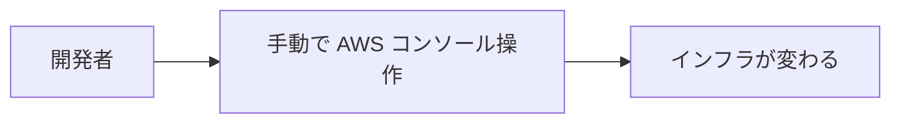
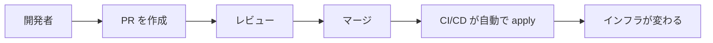
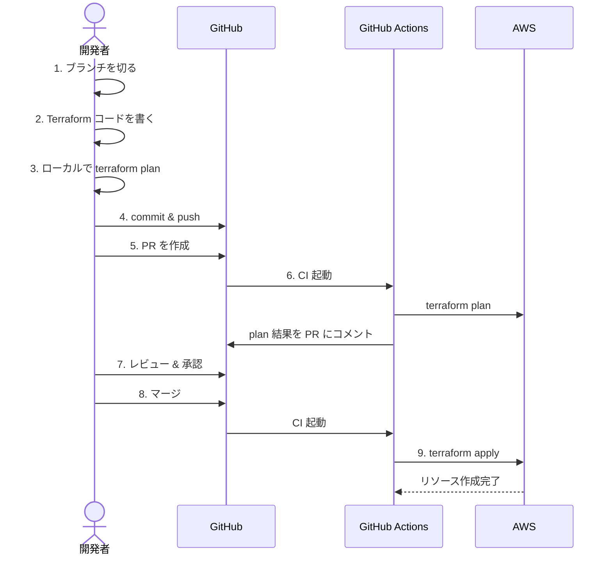

# Phase 3: GitOps ワークフロー

## GitOps とは

**Git をインフラの唯一の信頼できる情報源 (Single Source of Truth) として扱う運用手法。**

従来の運用:



GitOps:



### GitOps の原則

1. **宣言的** — あるべき状態をコードで記述する (Terraform)
2. **バージョン管理** — すべての変更は Git に記録される
3. **自動適用** — マージされたら自動でインフラに反映される
4. **差分検知** — 実際の状態とコードの差分を常に検知できる

## ブランチ戦略

### ルール

- `main` への直接 push は禁止
- すべての変更は PR 経由
- PR には `terraform plan` の結果を自動コメント
- マージ時に `terraform apply` を自動実行

## GitHub Actions パイプライン

### ディレクトリ構成

```
.github/
└── workflows/
    ├── terraform-plan.yml    # PR 時: plan を実行してコメント
    └── terraform-apply.yml   # main マージ時: apply を実行
```

### Plan ワークフロー (PR 時)

```yaml
# .github/workflows/terraform-plan.yml
name: Terraform Plan

on:
  pull_request:
    paths:
      - "envs/**"
      - "modules/**"

permissions:
  contents: read
  pull-requests: write
  id-token: write

jobs:
  plan:
    runs-on: ubuntu-latest
    strategy:
      matrix:
        env: [dev]  # 環境を増やしたら stg, prod を追加

    steps:
      - uses: actions/checkout@v4

      - uses: hashicorp/setup-terraform@v3
        with:
          terraform_version: 1.5.7

      - name: Configure AWS credentials
        uses: aws-actions/configure-aws-credentials@v4
        with:
          role-to-assume: ${{ secrets.AWS_ROLE_ARN }}
          aws-region: ap-northeast-1

      - name: Terraform Init
        working-directory: envs/${{ matrix.env }}
        run: terraform init

      - name: Terraform Format Check
        working-directory: envs/${{ matrix.env }}
        run: terraform fmt -check -recursive

      - name: Terraform Validate
        working-directory: envs/${{ matrix.env }}
        run: terraform validate

      - name: Terraform Plan
        id: plan
        working-directory: envs/${{ matrix.env }}
        run: terraform plan -no-color -out=tfplan
        continue-on-error: true

      - name: Comment PR with Plan
        uses: actions/github-script@v7
        with:
          script: |
            const output = `#### Terraform Plan - \`${{ matrix.env }}\`
            \`\`\`
            ${{ steps.plan.outputs.stdout }}
            \`\`\`
            *Triggered by @${{ github.actor }}*`;

            github.rest.issues.createComment({
              issue_number: context.issue.number,
              owner: context.repo.owner,
              repo: context.repo.repo,
              body: output
            });

      - name: Fail if plan failed
        if: steps.plan.outcome == 'failure'
        run: exit 1
```

### Apply ワークフロー (マージ時)

```yaml
# .github/workflows/terraform-apply.yml
name: Terraform Apply

on:
  push:
    branches:
      - main
    paths:
      - "envs/**"
      - "modules/**"

permissions:
  contents: read
  id-token: write

jobs:
  apply:
    runs-on: ubuntu-latest
    environment: production  # GitHub Environment で承認ゲートを設定可能
    strategy:
      matrix:
        env: [dev]

    steps:
      - uses: actions/checkout@v4

      - uses: hashicorp/setup-terraform@v3
        with:
          terraform_version: 1.5.7

      - name: Configure AWS credentials
        uses: aws-actions/configure-aws-credentials@v4
        with:
          role-to-assume: ${{ secrets.AWS_ROLE_ARN }}
          aws-region: ap-northeast-1

      - name: Terraform Init
        working-directory: envs/${{ matrix.env }}
        run: terraform init

      - name: Terraform Apply
        working-directory: envs/${{ matrix.env }}
        run: terraform apply -auto-approve
```

## OIDC で AWS に認証する (アクセスキー不要)

GitHub Actions からアクセスキーを使わずに AWS にアクセスする。

```hcl
# modules/github-oidc/main.tf

data "aws_iam_openid_connect_provider" "github" {
  url = "https://token.actions.githubusercontent.com"
}

resource "aws_iam_role" "github_actions" {
  name = "github-actions-terraform"

  assume_role_policy = jsonencode({
    Version = "2012-10-17"
    Statement = [
      {
        Effect = "Allow"
        Principal = {
          Federated = data.aws_iam_openid_connect_provider.github.arn
        }
        Action = "sts:AssumeRoleWithWebIdentity"
        Condition = {
          StringEquals = {
            "token.actions.githubusercontent.com:aud" = "sts.amazonaws.com"
          }
          StringLike = {
            "token.actions.githubusercontent.com:sub" = "repo:<YOUR_ORG>/<YOUR_REPO>:*"
          }
        }
      }
    ]
  })
}

resource "aws_iam_role_policy_attachment" "admin" {
  role       = aws_iam_role.github_actions.name
  policy_arn = "arn:aws:iam::aws:policy/AdministratorAccess"
  # 本番ではより制限的なポリシーを使う
}
```

## PR ワークフローの全体像



## 安全装置

### 1. Branch Protection

GitHub リポジトリの Settings > Branches で設定:

- `main` ブランチへの直接 push を禁止
- PR に最低 1 人のレビューを必須化
- CI (terraform plan) の成功を必須化

### 2. Terraform のセーフガード

```hcl
# 重要なリソースの削除防止
resource "aws_s3_bucket" "important" {
  bucket = "critical-data"

  lifecycle {
    prevent_destroy = true
  }
}
```

### 3. Policy as Code (応用)

```yaml
# .github/workflows/terraform-plan.yml に追加
- name: tfsec (セキュリティスキャン)
  uses: aquasecurity/tfsec-action@v1.0.0
  with:
    working_directory: envs/${{ matrix.env }}
```

## 次のステップ

- [Phase 4: プロジェクト構成ガイド](04-project-structure.md) でスケーラブルなディレクトリ設計を学ぶ
