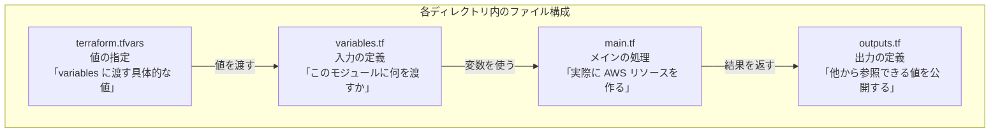
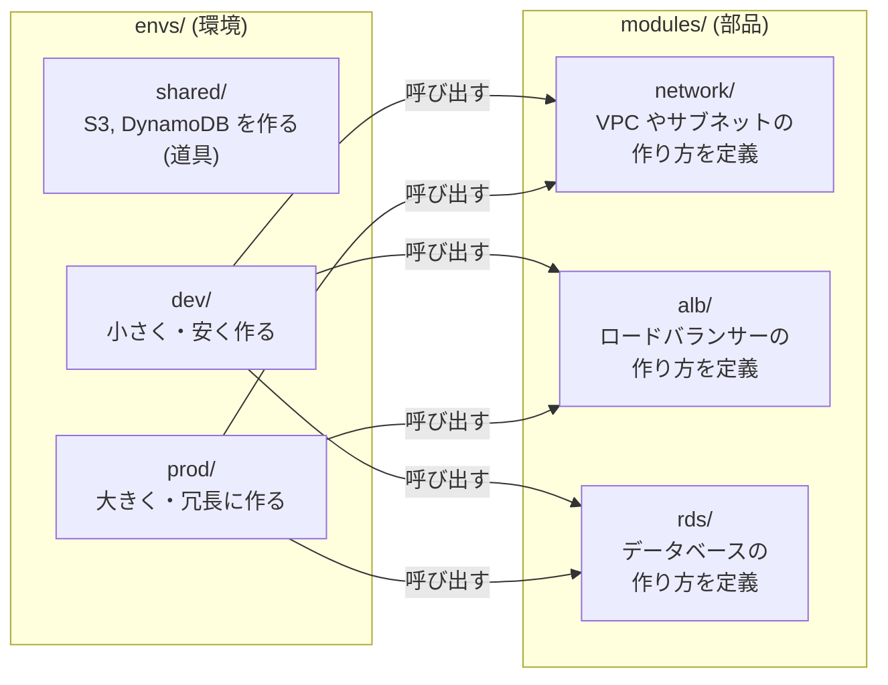
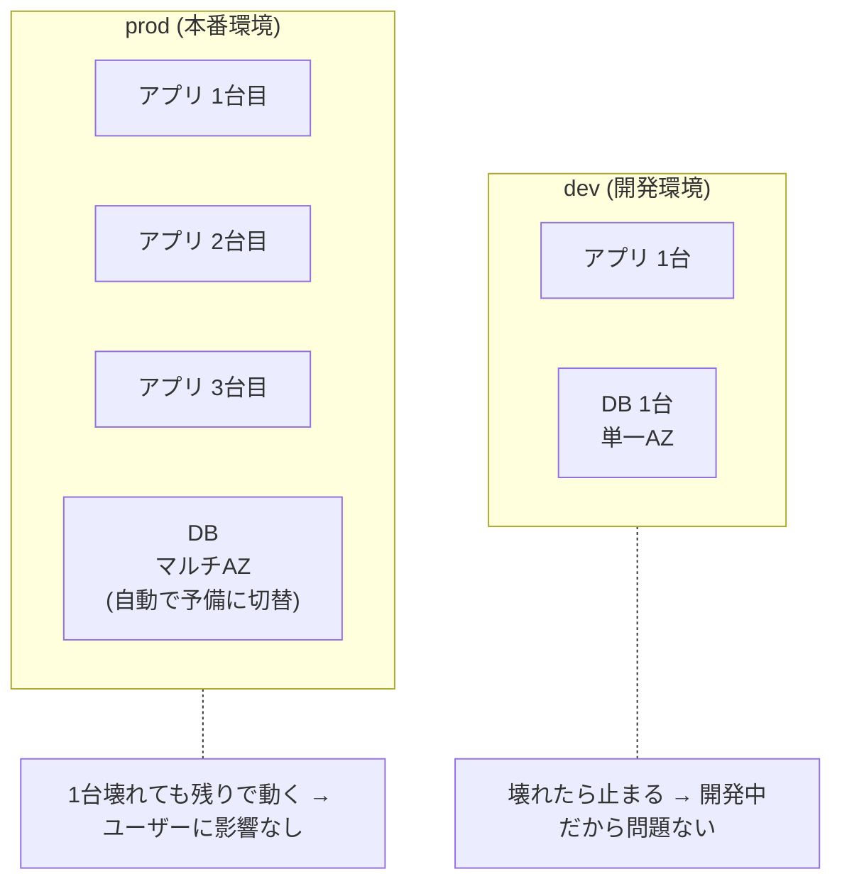

# Phase 4: プロジェクト構成ガイド

## 設計方針

| 方針 | 意味 |
|------|------|
| **環境とモジュールを分離する** | 「何を作るか (modules)」と「どこに作るか (envs)」を分けて管理する |
| **影響範囲を小さくする** | 1 回の `terraform apply` で壊れる範囲を限定する。dev を変えても prod に影響しない |
| **DRY にしすぎない** | コードの重複をなくす (DRY) のは大事だが、やりすぎると読みにくくなる |

## Terraform ファイルの役割

Terraform では **ファイル名に特別な意味はない** (全部 `.tf` として読み込まれる)。ただし、以下の命名が慣習になっている。



| ファイル | 役割 | 料理にたとえると |
|---------|------|-----------------|
| `variables.tf` | **入力の定義**。「このモジュールはこういうパラメータを受け取る」と宣言する | レシピの「材料一覧」 |
| `main.tf` | **メインの処理**。実際に AWS リソースを作るコードを書く | レシピの「手順」 |
| `outputs.tf` | **出力の定義**。作ったリソースの情報を外部に公開する | 完成した料理を「配膳する」 |
| `terraform.tfvars` | **変数の値**。variables.tf で定義した変数に具体的な値を渡す。**envs/ でのみ使う** | 実際に使う「材料そのもの」 |
| `providers.tf` | **プロバイダー設定**。AWS のリージョンや Terraform バージョンを指定する (main.tf に書くこともある) | 「どのキッチン (AWS リージョン) で作るか」 |

### 具体例: variables.tf → terraform.tfvars の関係

```hcl
# variables.tf — 「env という文字列の変数を受け取ります」と宣言
variable "env" {
  type        = string
  description = "環境名"
}

variable "instance_type" {
  type        = string
  description = "EC2 のインスタンスタイプ"
}
```

```hcl
# terraform.tfvars — 上で宣言した変数に実際の値を入れる
env           = "dev"
instance_type = "t3.micro"
```

## ディレクトリ構成

```
platform-infra/
│
├── modules/                        # 「何を作るか」の定義 (再利用可能な部品)
│   ├── network/                    #   ネットワーク部品 (VPC, Subnet, SG)
│   │   ├── main.tf                 #     リソース定義
│   │   ├── variables.tf            #     入力パラメータ
│   │   ├── outputs.tf              #     出力 (VPC ID など)
│   │   └── README.md               #     使い方の説明
│   ├── ecs/                        #   コンテナ実行基盤
│   ├── rds/                        #   データベース
│   ├── alb/                        #   ロードバランサー
│   └── github-oidc/                #   GitHub Actions 認証
│
├── envs/                           # 「どこに作るか」の指定 (環境ごとのエントリポイント)
│   │                               #   フォルダごとに terraform apply を実行する
│   │                               #   → 他のフォルダには影響しない
│   │
│   ├── shared/                     #   Terraform 自身の道具 (S3, DynamoDB)
│   │   ├── main.tf                 #     S3 バケット, DynamoDB テーブルを作る
│   │   ├── variables.tf            #     入力定義
│   │   ├── outputs.tf              #     出力 (バケット名など)
│   │   └── terraform.tfvars        #     shared 固有の値
│   │
│   ├── dev/                        #   開発環境のインフラ本体
│   │   ├── main.tf                 #     modules/ を呼び出して VPC, ALB, DB などを作る
│   │   ├── variables.tf
│   │   ├── outputs.tf
│   │   └── terraform.tfvars        #     dev 固有の値 (小さいインスタンスなど)
│   ├── stg/                        #   ステージング環境のインフラ本体
│   └── prod/                       #   本番環境のインフラ本体
│
├── .github/
│   └── workflows/
│       ├── terraform-plan.yml      # PR 時に plan を自動実行
│       └── terraform-apply.yml     # main マージ時に apply を自動実行
│
├── .gitignore                      # Git に含めないファイルの指定
├── README.md                       # プロジェクトの説明
└── docs/                           # 学習ドキュメント
```

### envs/ の各フォルダの違い

envs/ 内のフォルダは**それぞれ作るものが違う**。shared はインフラ本体ではなく、Terraform 自身が使う道具を作る。

| フォルダ | 作るもの | たとえると | いつ実行するか |
|---------|---------|-----------|--------------|
| `envs/shared/` | S3、DynamoDB | 工具箱を買う | 最初に1回だけ |
| `envs/dev/` | VPC、ALB、アプリ、DB | 練習用の家を建てる | 普段の開発 |
| `envs/prod/` | VPC、ALB、アプリ、DB | 本番の家を建てる | 本番デプロイ |

詳しくは [Phase 2: Remote State の設定](02-aws-infrastructure.md#remote-state-の設定) を参照。

### modules/ と envs/ の関係



- **modules/** = 「VPC はこう作る」という**設計図** (部品のテンプレート)
- **envs/** = 「dev では小さく、prod では大きく」という**発注書** (具体的な値を指定して modules を呼び出す)

## モジュールの書き方

### 基本ルール

1. **1 モジュール = 1 責務** (network, ecs, rds など)
2. **入出力を明確にする** — `variables.tf` と `outputs.tf` を必ず書く
3. **ハードコードしない** — 環境固有の値は変数にする
4. **デフォルト値は dev 想定** — prod では明示的に上書きする

### モジュールのテンプレート

```hcl
# modules/<module_name>/variables.tf

variable "name_prefix" {
  type        = string
  description = "リソース名のプレフィックス"
}

variable "tags" {
  type        = map(string)
  description = "共通タグ"
  default     = {}
}
```

```hcl
# modules/<module_name>/main.tf

resource "aws_xxx" "main" {
  name = "${var.name_prefix}-xxx"
  tags = var.tags
}
```

```hcl
# modules/<module_name>/outputs.tf

output "id" {
  value       = aws_xxx.main.id
  description = "リソース ID"
}
```

### 環境からモジュールを呼び出す

```hcl
# envs/dev/main.tf

module "network" {
  source = "../../modules/network"

  name_prefix        = "platform-infra-dev"
  vpc_cidr           = "10.0.0.0/16"
  azs                = ["ap-northeast-1a", "ap-northeast-1c"]
  public_subnets     = ["10.0.1.0/24", "10.0.2.0/24"]
  private_app_subnets = ["10.0.11.0/24", "10.0.12.0/24"]
  private_db_subnets  = ["10.0.21.0/24", "10.0.22.0/24"]
}

module "alb" {
  source = "../../modules/alb"

  name_prefix       = "platform-infra-dev"
  vpc_id            = module.network.vpc_id
  public_subnet_ids = module.network.public_subnet_ids
  security_group_id = module.network.alb_sg_id
}
```

## 環境間の差分管理

### なぜ環境ごとにサイズを変えるのか

本番 (prod) はユーザーが実際に使うので、**1台壊れても止まらないように**冗長に作る。開発 (dev) は動作確認が目的なので、最小構成にしてコストを抑える。



| | dev (開発) | prod (本番) |
|---|---|---|
| **サーバー台数** | 1台 (動けばいい) | 3台 (1台壊れても残り2台で動く) |
| **サーバーサイズ** | t3.micro (最小) | t3.medium (余裕あり) |
| **DB** | シングル (1箇所) | マルチAZ (障害時に自動で予備に切替) |
| **コスト** | 安い | 高い (冗長化の分) |

同じ modules (設計図) を使いつつ、terraform.tfvars の値を変えるだけで構成を切り替える。

### terraform.tfvars で環境を分ける

```hcl
# envs/dev/terraform.tfvars — 最小構成・安く
env               = "dev"
instance_type     = "t3.micro"       # 最小サイズのサーバー
db_instance_class = "db.t3.micro"    # 最小サイズの DB
desired_count     = 1                # アプリ 1台だけ
multi_az          = false            # DB は 1箇所だけ (予備なし)
```

```hcl
# envs/prod/terraform.tfvars — 冗長構成・止まらないように
env               = "prod"
instance_type     = "t3.medium"      # 余裕のあるサイズ
db_instance_class = "db.r6g.large"   # 高性能な DB
desired_count     = 3                # アプリ 3台 (1台壊れても動く)
multi_az          = true             # DB を 2箇所に (障害時に自動切替)
```

## 命名規則

| 項目 | ルール | 例 |
|------|--------|-----|
| リソース名 | `{project}-{env}-{role}` | `platform-infra-dev-vpc` |
| モジュール名 | 機能を表す単語 | `network`, `ecs`, `rds` |
| 変数名 | snake_case | `vpc_cidr`, `name_prefix` |
| ファイル名 | 役割ごとに分割 | `main.tf`, `variables.tf`, `outputs.tf` |
| タグ | `Project`, `Environment`, `ManagedBy` | 全リソースに付与 |

## .gitignore

Git にコミットしてはいけないファイルを指定する。

```gitignore
# Terraform
*.tfstate              # state ファイル (リソースの現在状態。シークレットを含む可能性がある)
*.tfstate.backup       # state のバックアップ
*.tfstate.lock.info    # state のロック情報 (誰かが apply 中であることを示す)
.terraform/            # プロバイダーのバイナリ (terraform init で自動ダウンロード)
.terraform.lock.hcl    # プロバイダーのバージョンロック (チームではコミットすることもある)
crash.log              # Terraform がクラッシュした時のログ
override.tf            # ローカルで一時的に設定を上書きするファイル
override.tf.json       # 同上 (JSON 版)
*_override.tf          # 同上 (プレフィックス付き)
*_override.tf.json     # 同上
*.tfplan               # plan の保存ファイル

# OS
.DS_Store              # macOS がフォルダごとに自動生成するファイル

# IDE
.idea/                 # JetBrains 系 IDE の設定
.vscode/               # VS Code の設定
*.swp                  # Vim の一時ファイル
```

## よくあるアンチパターン

### 1. 巨大な main.tf

```
BAD:  envs/dev/main.tf に全リソースを書く (500行超え)
GOOD: modules/ に分割して envs/ から呼び出す
```

### 2. 環境ごとにコードをコピー

```
BAD:  envs/dev/vpc.tf と envs/prod/vpc.tf が 95% 同じ
GOOD: modules/network に共通化して tfvars で差分を吸収
```

### 3. state を分割しない

```
BAD:  全環境が 1 つの state (dev の apply で prod が壊れるリスク)
GOOD: 環境ごとに state を分離 (envs/dev, envs/prod それぞれに backend)
```

### 4. 秘密情報のハードコード

```
BAD:  password = "mypassword123"
GOOD: AWS Secrets Manager or SSM Parameter Store を参照する
```

```hcl
data "aws_ssm_parameter" "db_password" {
  name = "/${var.env}/db/password"
}

resource "aws_db_instance" "main" {
  password = data.aws_ssm_parameter.db_password.value
}
```

## 発展: Terragrunt

プロジェクトが大きくなったら [Terragrunt](https://terragrunt.gruntwork.io/) の導入を検討する。

- backend 設定の DRY 化
- モジュール間の依存関係管理
- 複数環境の一括 plan/apply

ただし学習段階では Terraform 単体で十分理解してから移行すること。
